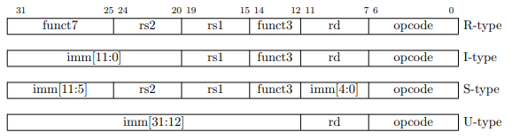
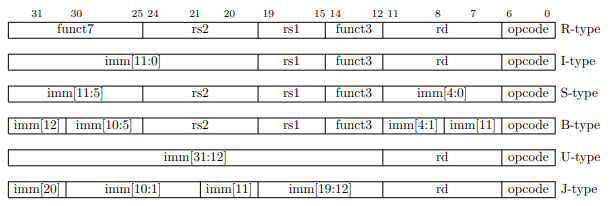
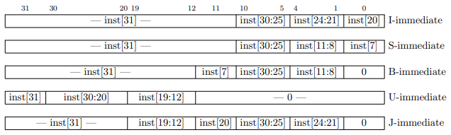

# RISC-V

This project aims to implement the RV32I Base Integer Instruction Set. This implementation remains a work in progress. Additionally, a basic assembler has been written in Python to aid in generating instructions for the CPU.

The beginning of this implementation was originally written for my Digital Design with Programmable Logic (EE 4301) course at the University of Minnesota.

[iverilog](github.com/steveicarus/iverilog) is used for compiling/running the verilog.

## Running the Code

Compiling: `make` (or `make riscv`)

Run `make clean` to remove `riscv`

## Registers

| Register | ABI Name | Description                       | Saver  |
| -------- | -------- | --------------------------------- | ------ |
| x0       | zero     | Hard-wired zero                   | --     |
| x1       | ra       | Return address                    | Caller |
| x2       | sp       | Stack pointer                     | Callee |
| x3       | gp       | Global pointer                    | --     |
| x4       | tp       | Thread pointer                    | --     |
| x5       | t0       | Temporary/alternate link register | Caller |
| x6-7     | t1-t2    | Temporaries                       | Caller |
| x8       | s0/fp    | Saved register/frame pointer      | Callee |
| x9       | s1       | Saved register                    | Callee |
| x10-11   | a0-1     | Function arguments/return values  | Caller |
| x12-17   | a2-7     | Function arguments                | Caller |
| x18-27   | s2-11    | Saved registers                   | Callee |
| x28-31   | t3-6     | Temporaries                       | Caller |

Assembler mnemonics for RISC-V integer registers. (See Table 25.1)

## Pseudoinstructions

See tables 25.2 and 25.3.

| Pseudoinstruction  | Base Instruction     | Meaning               |
| ------------------ | -------------------- | --------------------- |
| `nop`              | `addi x0, x0, 0`     | No operation          |
| `li rd, immediate` |                      | Load immediate        |
| `mv rd, rs`        | `addi rd, rs, 0`     | Copy register         |
| `not rd, rs`       | `xori rd, rs, -1`    | One's complement      |
| `neg rd, rs`       | `sub rd, x0, rs`     | Two's complement      |
| `negw rd, rs`      | `subw rd, x0, rs`    | Two's complement word |
| `sext.w rd, rs`    | `addiw rd, rs, 0`    | Sign extend word      |
| `seqz rd, rs`      | `sltiu rd, rs, 1`    | Set if = zero         |
| `snez rd, rs`      | `sltu rd, x0, rs`    | Set if ≠ zero         |
| `sltz rd, rs`      | `slt rd, rs, x0`     | Set if < zero         |
| `sgtz rd, rs`      | `slt rd, x0, rs`     | Set if > zero         |

| Pseudoinstruction  | Base Instruction     | Meaning               |
| ------------------ | -------------------- | --------------------- |
| `beqz rs, offset`  | `beq rs, x0, offset` | Branch if = zero      |
| `bnez rs, offset`  | `bne rs, x0, offset` | Branch if ≠ zero      |
| `blez rs, offset`  | `bge x0, rs, offset` | Branch if ≤ zero      |
| `bgez rs, offset`  | `bge rs, x0, offset` | Branch if
| `bltz rs, offset`  | `blt rs, x0, offset` | Branch if < zero
| `bgtz rs, offset`  | `blt x0, rs, offset` | Branch if > 

| Pseudoinstruction     | Base Instruction       | Meaning               |
| --------------------- | ---------------------- | --------------------- |
| `bgt rs, rt, offset`  | `blt rt, rs, offset`   | Branch if >           |
| `ble rs, rt, offset`  | `bge rt, rs, offset`   | Branch if ≤           |
| `bgtu rs, rt, offset` | `bltu rt, rs, offset`  | Branch if >, unsigned |
| `bleu rs, rt, offset` | `bgeu rt, rs, offset`  | Branch if ≤, unsigned |

| Pseudoinstruction     | Base Instruction       | Meaning                       |
| --------------------- | ---------------------- | ----------------------------- |
| `j offset`            | `jal x0, offset`       | Jump                          |
| `jal x1, offset`      | `jal x1, offset`       | Jump and link                 |
| `jr rs`               | `jalr x0, 0(rs)`       | Jump register                 |
| `jalr rs`             | `jalr x1, 0(rs)`       | Jump and link register        |
| `ret`                 | `jalr x0, 0(x1)`       | Return from subroutine        |
| `call offset`         |                        | Call far-away subroutine      |
| `tail offset`         |                        | Tail call far-away subroutine |

## Useful Figures

All figures in this section are from the RISC-V Instruction Set Manual.

Figure 2.2: RISC-V base instruction formats. Each immediate subfield is labeled with the bit position (imm[x]) in the immediate value being produced, rather than the bit position within the instruction’s immediate field as is usually done.

Figure 2.3: RISC-V base instruction formats showing immediate variants.

Figure 2.4: Types of immediate produced by RISC-V instructions. The fields are labeled with the instruction bits used to construct their value. Sign extension always uses inst[31].

## Opcodes

From Chapter 24: RV32/64G Instruction Set Listings.

### R-type
| instruction | funct7    | rs2 | rs1 | funct3 | rd | opcode    |
| ----------- | --------- | --- | --- | ------ | -- | --------- |
| `ADD`       | `0000000` | rs2 | rs1 | `000`  | rd | `0110011` |
| `SUB`       | `0100000` | rs2 | rs1 | `000`  | rd | `0110011` |
| `SLL`       | `0000000` | rs2 | rs1 | `001`  | rd | `0110011` |
| `SLT`       | `0000000` | rs2 | rs1 | `010`  | rd | `0110011` |
| `SLTU`      | `0000000` | rs2 | rs1 | `011`  | rd | `0110011` |
| `XOR`       | `0000000` | rs2 | rs1 | `100`  | rd | `0110011` |
| `SRL`       | `0000000` | rs2 | rs1 | `101`  | rd | `0110011` |
| `SRA`       | `0100000` | rs2 | rs1 | `101`  | rd | `0110011` |
| `OR`        | `0000000` | rs2 | rs1 | `110`  | rd | `0110011` |
| `AND`       | `0000000` | rs2 | rs1 | `111`  | rd | `0110011` |

### I-type
| Instruction | imm | rs1 | funct3 | rd | opcode    |
| ----------- | --- | --- | ------ | -- | --------- |
| `ADDI`      | imm | rs1 | `000`  | rd | `0010011` |
| `SLTI`      | imm | rs1 | `010`  | rd | `0010011` |
| `SLTIU`     | imm | rs1 | `011`  | rd | `0010011` |
| `XORI`      | imm | rs1 | `100`  | rd | `0010011` |
| `ORI`       | imm | rs1 | `110`  | rd | `0010011` |
| `ANDI`      | imm | rs1 | `111`  | rd | `0010011` |
| `LB`        | imm | rs1 | `000`  | rd | `0000011` |
| `LH`        | imm | rs1 | `001`  | rd | `0000011` |
| `LW`        | imm | rs1 | `010`  | rd | `0000011` |
| `LBU`       | imm | rs1 | `100`  | rd | `0000011` |
| `LHU`       | imm | rs1 | `101`  | rd | `0000011` |
| `JALR`      | imm | rs1 | `000`  | rd | `1100111` |

| Instruction | imm       | shamt | rs1 | funct3 | rd | opcode    |
| ----------- | --------- | ----- | --- | ------ | -- | --------- |
| `SLLI`      | `0000000` | shamt | rs1 | `001`  | rd | `0010011` |
| `SRLI`      | `0000000` | shamt | rs1 | `101`  | rd | `0010011` |
| `SRAI`      | `0100000` | shamt | rs1 | `101`  | rd | `0010011` |

### S-type
| instruction | imm | rs2 | rs1 | funct3 | imm | opcode    |
| ----------- | --- | --- | --- | ------ | --- | --------- |
| `SB`        | imm | rs2 | rs1 | `000`  | imm | `0100011` |
| `SH`        | imm | rs2 | rs1 | `001`  | imm | `0100011` |
| `SW`        | imm | rs2 | rs1 | `010`  | imm | `0100011` |

### B-type
| instruction | imm | rs2 | rs1 | funct3 | imm | opcode    |
| ----------- | --- | --- | --- | ------ | --- | --------- |
| `BEQ`       | imm | rs2 | rs1 | `000`  | imm | `1100011` |
| `BNE`       | imm | rs2 | rs1 | `001`  | imm | `1100011` |
| `BLT`       | imm | rs2 | rs1 | `100`  | imm | `1100011` |
| `BGE`       | imm | rs2 | rs1 | `101`  | imm | `1100011` |
| `BLTU`      | imm | rs2 | rs1 | `110`  | imm | `1100011` |
| `BGEU`      | imm | rs2 | rs1 | `111`  | imm | `1100011` |

### U-type

| instruction | imm | rd | opcode    |
| ----------- | --- | -- | --------- |
| `LUI`       | imm | rd | `0110111` |
| `AUIPC`     | imm | rd | `0010111` |

### J-type

| instruction | imm | rd | opcode    |
| ----------- | --- | -- | --------- |
| `JAL`       | imm | rd | `1100011` |

## Resources

[The RISC-V Instruction Set Manual (Volume 1)](https://github.com/riscv/riscv-isa-manual/releases/download/Ratified-IMAFDQC/riscv-spec-20191213.pdf)
